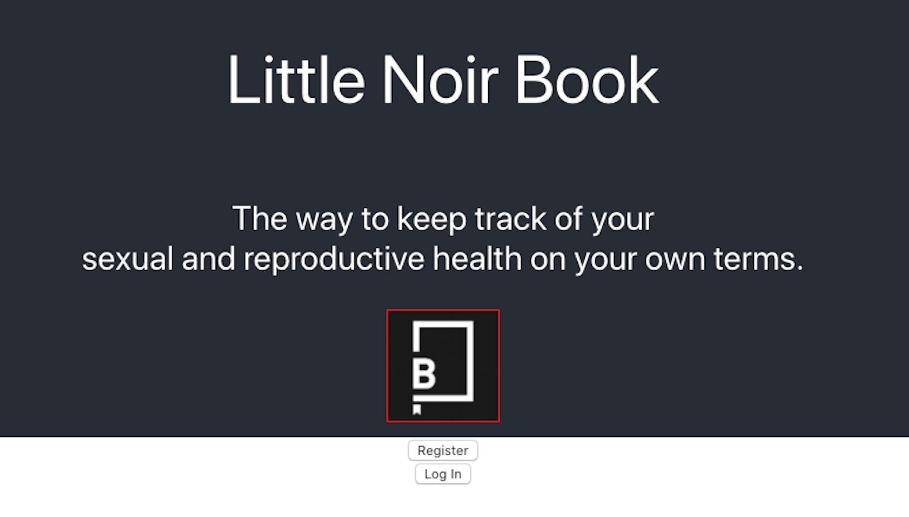

## Overview

Little Noir Book is an application that allows individuals to keep track of their sexual and reproductive health on their own terms. 

By creating unique entries of encounters, users are able to update and see all of their expereinces and keep logs of how safe they've been and create little vignettes for their own use. 

Little Noir Book provides information about all NYC DOH clinics that offer free or low-cost treatment and assistance. By means of the NYC Open Data API, all locations are displayed along with pertinent information: hours and days of operation, address, phone numbers if available.

Little Noir Book provides links to organizations and information catered to different demographics of people: for example, LGBTQ, Women, Domestic Abuse Victims, and more being added as the project grows.

This app was created with the intent to help people from all walks but it's primarily geared to the LGBTQ population and women, two populations that suffer from a disproprotionately high rate of sexually transmitted disease and sexual abuse. 

As of now, project is still in a very beta phase and will be deployed to Heroku within the next couple of weeks. Updates forthcoming and will be detailed within the updates section of the table of contents.

#### Hopefully, you'll be inspired or find use in what I've done!

---

## Table of Contents

- [Installation](#installation)
- [Technologies Used](#technologies-used )
- [Features](#features)
- [Team](#team)
- [FAQ](#faq)
- [Updates](#updates)
- [Contact](#contact)


---
### Installation

```
git clone https://github.com/steve-ramirez-can-code/LittleNoirBook.git
npm install
npm start
this starts the frontend and backend of the project 
```
---
#### Technologies Used
|React|NodeJS|ExpressJS|
|--|--|--|
|**PostgresSQL**|**Concurrently**|**Nodemon**|
|**Axios**|**Morgan**||
---
### Features

Many features are slated for use within this application, however given current constraints some have been put on the backburner for now. 

Upcoming Features:

- Ability to share vignettes with healthcare professional securely and confidentially.
- Ability to add additional security measures to prevent unwanted access from others.
- Using geolocation for real-time Physician and Specialist search.
- Ability to add more reproductive information within a calendar view.
- Many more to come.

---
### Team

|Steve Ramirez|
|---|
|<a href="https://www.linkedin.com/in/steve-ramirez-can-code/" target="_blank">**linkedin.com/in/steve-ramirez-can-code/**</a> |
|<a href="https://github.com/steve-ramirez-can-code" target="_blank">**github.com/steve-ramirez-can-code**</a> |
| [](https://github.com/steve-ramirez-can-code)|

---


### FAQ

- **When do you think this project will be up and ready for Heroku?**
    - There are still some major functionality kinks to work out and it's a fair amount of work for one person so I ask that you please be patient. However, I do feel that I should have it up and running on Heroku, around Midsummer 2020. Please keep an eye on our updates section for more details.

---
### Updates  
**04/23/2020**
- Created a fully fleshed out readme file for this project
- Committed necessary changes for function
- Began work on the server/backend logic
- Started manual testing for apparent bug
- Currently in a proof of concept phase with backend still producing known errors
- Requires manual navigation to and from different established routes and database needs to be set up

---

### Contact

Feel free to reach out to me if you'd like to chat or would like some more information about this passion project of mine. 

- LinkedIn profile at <a href="https://www.linkedin.com/in/steve-ramirez-can-code/" target="_blank"> Steve Ramirez</a>
- Github profile at <a href="https://github.com/steve-ramirez-can-code" target="_blank"> Steve Ramirez</a>


testing git commits this is gittest -> lnb
testing git commits this is projects -> l-n-b
